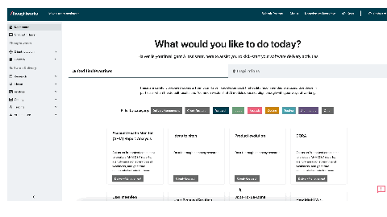

# Haiven MCP Server

**Seamlessly connect any MCP-compatible AI tool to your organization's Haiven servers and access expertly crafted prompts directly within your tools.**

## **Quick Start**

### **Option 1: Copy Configuration (Easiest)**
**_You must have docker installed on your machine_**

- Copy the MCP server configuration below and add it to your AI tool's **existing MCP settings**.

- **Add this MCP server to your configuration:**
```json
"haiven-prompts": {
  "command": "docker",
  "args": [
    "run", "-i", "--rm",
    "-e", "HAIVEN_API_KEY=your-api-key-here",
    "-e", "HAIVEN_API_URL=https://your-haiven-server.com",
    "ghcr.io/tw-haiven/haiven-mcp-server:latest"
  ]
}
```

- **Replace these values:**
 --  `your-api-key-here` → Your API key from Haiven
 -- `https://your-haiven-server.com` → Your organization's Haiven server URL

**Where to add the configuration:**
Check your AI tool's official documentation for MCP server configuration settings. Look for:
- "MCP servers" or "Model Context Protocol"
- "External tools" or "Integrations"
- Settings for adding custom servers

**MCP Setup Resources:**
- **[VS Code MCP Servers](https://code.visualstudio.com/docs/copilot/chat/mcp-servers)** - Comprehensive guide for VS Code
- **[Claude Code MCP](https://docs.anthropic.com/en/docs/claude-code/mcp)** - Official Claude documentation
- **[Cursor MCP Setup](https://docs.cursor.com/en/context/mcp#using-mcp-json)** - Cursor-specific instructions
- **[MCP Protocol Overview](https://modelcontextprotocol.io/quickstart/user#understanding-mcp-servers)** - General MCP concepts

**Example of where to add it:**
If your config already has other MCP servers, add it alongside them:
```json
{
  "mcpServers": {
    "existing-server": { ... },
    "haiven-prompts": {
      "command": "docker",
      "args": [
        "run", "-i", "--rm",
        "-e", "HAIVEN_API_KEY=your-api-key-here",
        "-e", "HAIVEN_API_URL=https://your-haiven-server.com",
        "ghcr.io/tw-haiven/haiven-mcp-server:latest"
      ]
    }
  }
}
```

### **Option 2: Advanced Setup**
For advanced users or custom configurations, see [USER_SETUP_GUIDE.md](docs/USER_SETUP_GUIDE.md).

---

## **What You'll Need**

- **An MCP-compatible AI tool** (Claude Desktop, VS Code, Cursor, etc.)
- **Access to your organization's Haiven system**
- **API key** from your Haiven instance

## **Get Your API Key**

1. Open Haiven in your browser
2. Login with your work credentials
3. Click "API Keys" in the navigation
4. Click "Generate New API Key"
5. Copy the key immediately



## **What You Get**

After setup, you can:
- Ask your AI tool: "What Haiven prompts are available?"
- Execute Haiven prompts: "Using Haiven prompt create user story splitup for JIRA-1234"

---

## **For IT Teams**

This MCP server:
- Uses standard MCP protocol (JSON-RPC 2.0 over stdin/stdout)
- Supports API key authentication
- No data stored locally - all queries go to your Haiven server
- Works with **any MCP-compatible AI tool**
- **Multi-architecture Docker support** (AMD64 and ARM64)

### **Deployment Options**
- **Docker**: Container available for enterprise deployment (recommended)
- **Individual install**: Users run Docker commands on their machines
- **Centralized**: Deploy via software distribution systems

---

## **Need Help?**

- **End Users**: [USER_SETUP_GUIDE.md](docs/USER_SETUP_GUIDE.md) - Detailed setup instructions
- **Developers**: [DEVELOPER_GUIDE.md](docs/DEVELOPER_GUIDE.md) - Local development setup
- **Troubleshooting**: [TROUBLESHOOTING.md](docs/TROUBLESHOOTING.md) - Common issues and solutions

---

**Ready to connect your team to Haiven AI? Works with any MCP-compatible tool!**

## Overview

This MCP server provides a bridge between AI applications (IDEs, editors, AI assistants) and the Haiven AI prompts API. It enables seamless integration with tools like Claude Desktop, VS Code with MCP extensions, and other AI-powered development environments.

## Features

- **Standalone Service**: Independent from the main Haiven application
- **Standard MCP Protocol**: Uses JSON-RPC 2.0 over stdin/stdout
- **Two Main Tools**:
  - `get_prompts`: Retrieve all available prompts with metadata
  - `get_prompt_text`: Get the specific prompt content by ID
- **Comprehensive Error Handling**: Robust error handling and logging
- **Easy Configuration**: Simple setup and deployment
- **Docker Support**: Multi-architecture container deployment
- **Security Hardened**: Comprehensive security scanning and validation

## API Tools

### get_prompts

Retrieves all available prompts with their metadata and follow-ups.

**Parameters**: None

**Returns**: JSON object with prompts array and total count

**Example**:
```json
{
  "prompts": [
    {
      "identifier": "adr-9e6a21eb",
      "title": "Architecture Decision Record",
      "categories": [
        "architecture"
      ],
      "help_prompt_description": "..",
      "help_user_input": "..",
      "help_sample_input": "..",
      "type": "chat"
    }
  ],
  "total_count": 1
}
```

### get_prompt_text

fetches the content of a specific prompt

**Parameters**:
- `promptid` (required): ID of the prompt to fetch

**Returns**: json object containing the prompt content

**Example**:
```json
{
  "prompt_id": "prd-template-ideate",
  "title": "Draft PRD",
  "content": "...",
  "type": "chat",
  "follow_ups": []
}
```

## License

This project is licensed under the same terms as the main Haiven project.

## Contributing

1. Fork the repository
2. Create a feature branch
3. Make your changes
4. Add tests for new functionality
5. Submit a pull request

## Pre-commit Hooks

This repository uses [pre-commit](https://pre-commit.com/) to enforce code quality and security checks.

**All contributors must:**
1. Install pre-commit: `pip install pre-commit`
2. Run `pre-commit install` after cloning the repo (this sets up the git hooks).
3. Ensure all pre-commit hooks pass before pushing code: `pre-commit run --all-files`

Pre-commit will automatically run on every commit. If any hook fails, the commit will be blocked until you fix the issues.
